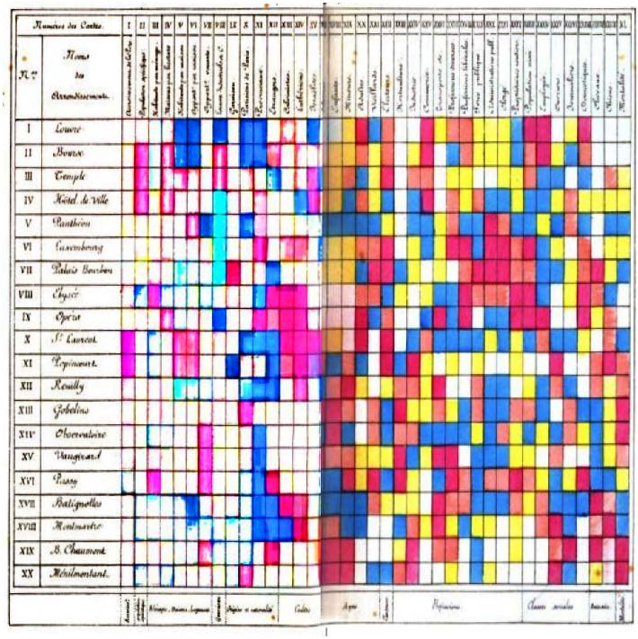
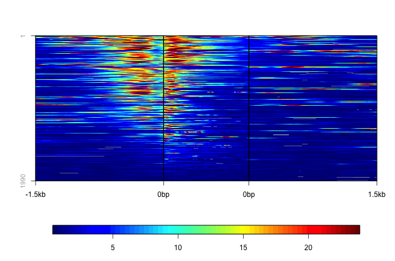
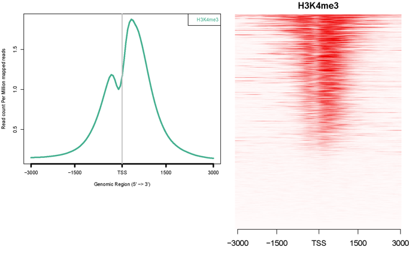
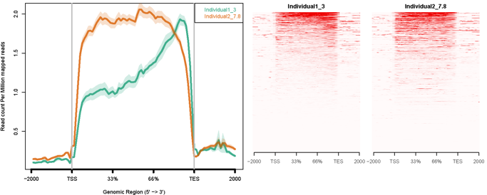
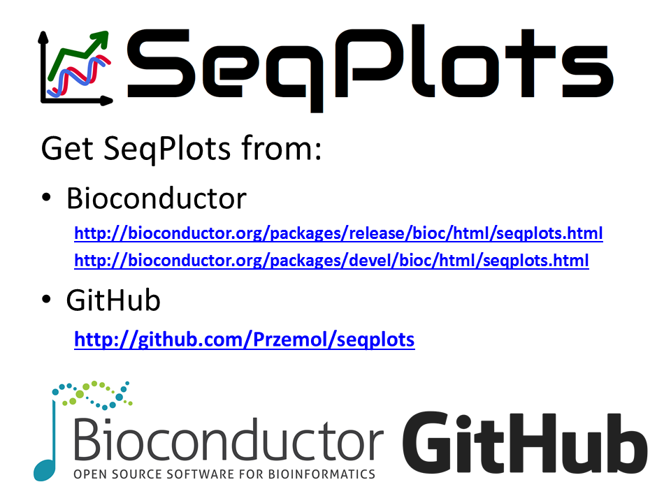

---
title: SeqPlots
author: Przemyslaw Stempor
framework: impressjs
#highlighter: highlight.js  # {highlight.js, prettify, highlight}
#hitheme: tomorrow  
#mode: draft
mode: selfcontained
--- #s .slide x:0 y:-2000 z:0

<h1><b style="font-size: 140%;">SeqPlots</b> - a fast interactive web tool for visualizing next generation sequencing signals along genomic features.</h1>

Przemyslaw Stempor @ Internal Seminar, 25 February 2015

--- #big x:0 y:-1250 rot:0 z:100 scale:1 .hide
The <b>BIG</b> question!

--- #q x:0 y:-700 z:0 rot:0 scale:2 .cent 
What are the **relationships** between **chromatin features**, underlying **DNA sequence** and **gene regulation**?

--- #qf1v2 x:-300 y:50 z:0 rot:0 scale:1.2

Source: http://www.cliffsnotes.com/assets/24452.jpg

--- #qf2 x:700 y:50 z:0 rot:0 scale:1.2

--- #o0 x:0 y:-220 z:600 rot:0 scale:1

--- #tools x:0 y:900 z:0 rot:0 scale:2

## Every BIG question needs **small tools**.

--- #t1 x:-350 y:1200 z:0 rot:0 scale:1.2
- ChIP-<b style="color: red;">seq</b>
- RNA-<b style="color: red;">seq</b>
- DNase-<b style="color: red;">seq</b>
- MNase-<b style="color: red;">seq</b>
- ATAC-<b style="color: red;">seq</b>

--- #rad x:-350 y:1650 z:0 rot:0 scale:1 .red

 

1. DNA library

2. Short reads

3. <b>Genomic position</b>

--- #problem x:300 y:1100 z:0 rot:0 roty:90 scale:1.2 .sm .hide
Technical problem – typical experiment produce **tens of 
millions** of such positions over **hundreds of millions to billions** possible
locations (base pairs) in the genome!

--- #solution1 x:300 y:1450 z:0 rot:0 scale:1 
<u>Solutions:</u>
- Shrink/simplify the data so they are small enough for us to understand (e.g. peak calls, unsupervised machine learning) 

--- #solution2 x:300 y:1750 z:0 rot:0 scale:1
- Use <b>data visualization</b> to make an original comprehensible to us

--- #o1 x:0 y:1400 z:600 rot:0 scale:1

--- #vis x:0 y:2400 z:0 rot:0 scale:2
## Scientific data visualization – is it important?

--- #v1 x:0 y:2650 z:0 rot:0 scale:2 .sm
- Data visualization is <b class="zzz">prevalent approach</b> in science

--- #v1a x:-1000 y:2650 z:300 roty:90 scale:1 .md

Shaded matrix display from Loua (1873).

--- #v2 x:0 y:3000 z:0 rot:0 scale:2.0 .sm
- Since the advent of sequencing techniques there is **great advance** in methods specific to this field 
- Helps us to **better understand the data** and find the patterns that might be lost due to shrinkage/simplification
- Great for **exploratory data analyses**
- Very useful for **results presentation**

--- #o2 x:-200 y:2800 z:600 rot:0 scale:1

--- #stat x:0 y:3900 z:0 rot:0 scale:3 .sm .hide
## We can visualize reads directly, but usually more useful is **converting them to a read coverage**

--- #statp1 x:-300 y:4600 z:200 rot:0 scale:1.5

 

--- #statp2 x:100 y:5200 z:0 rot:0 scale:1.5

--- #o3 x:0 y:4600 z:1200 rot:0 scale:1

--- #global x:3000 y:-2300 z:0 scale:2 
## *-seq data visualization: global approaches.

--- #circos x:3000 y:-1700 z:0 scale:1.2
 

--- #hibo x:3000 y:-1900 z:600 scale:1

--- #gb x:3000 y:-900 z:0 scale:2
## *-seq data visualization: genome browsers.

--- #ucsc x:2650 y:-500 z:0 scale:1 
UCSC Genome Browser

--- #igv x:3350 y:-500 z:0 scale:1
IGV (Broad Institute)

--- #biod x:2675 y:0 z:0 scale:1.05
Biodalliance (Thomas Down)

--- #biod x:3000 y:-100 z:0 scale:1.5

--- #gbo x:3000 y:-400 z:600 scale:1

--- #trf x:3000 y:2400 z:0 scale:2
## *-seq data visualization: multiple parts of genome, using pre-defined genomic features

--- #av x:3000 y:3100 z:0 scale:2  .sm .cent
 

--- #hm x:3000 y:3920 z:0 scale:2  .sm .cent
 

--- #osp x:3000 y:3250 z:1500 scale:1

--- #ngsp1 x:2550 y:5000 z:0 scale:1.2  .sm .cent
Command line tools, e.g. ngsplot

  

--- #dt1 x:3550 y:5000 z:0 scale:1.2 .sm .cent
Tools on Galaxy platform: deepTools, Cistrome, etc.

--- #logo x:3000 y:1300 scale:4
 

--- #why x:6000 y:-2200 scale:3 .cent

## Why do we need **yet another** visualization tool?

--- #why1 x:6000 y:-1600 scale:2 .md
Existing solutions did not meet our requirements:
- Custom scripts and pargramic languages labraries allows to run things in batch, 
  but are **too complicated** to run for users without IT expertise
- Even with good training these tools **requires a lot of time** to code
- Galaxy/Cistrome was too **slow** and **not configurable** enough 
  (plus **data privacy** problem!)

--- #why2 x:6000 y:-1000 scale:2 .cent .md
I want take the best from two worlds - connect the **intuitiveness** and **interactiveness** of genome browsers with **visualization power** of plotting 1000s of  genomic features at once.

--- #why3 x:6000 y:-500 scale:2 .cent .lg

Goal: **fast**, **intuitive** software for **exploratory data analyses**!

--- #seqplots x:6000 y:-50 scale:3 .cent
## SeqPlots is **this** software!

--- #spim x:6000 y:900 scale:2 .cent .md

We developed a highly configurable, **GUI operated web application** for **rapidly generating** sets of publication quality **linear plots** and **heatmaps**. 

--- #waod x:6000 y:2100 scale:2.5 .lg .cent
**See SeqPlots in action on the movie...**

--- #task x:6900 y:2800 scale:1 .slide z:380 roty:-90
## **Quick explanaton of the example in hand**

 

**Files - signal profiles from ChIP-seq experiments:**
- H3K4me3 (mark active promoters)
- H3K36me3 (mark transcribed regions of active genes)

**Files - genomic features:**
- *C. elegans* transcription start sites (TSS), divided into 5 expression bins 
  based on RNA-seq data

**Tasks:**
- Compare histone marks between highly and lowly expressed genes.
- Check if CpG (CG-dinucleotide) occupancy is higher on transcription start sites (TSS) relative to local neighborhood

--- #vid x:6000 y:2800 scale:1.8 .lg .cent
<iframe width="840" height="600" src="https://www.youtube.com/embed/9TKYZQa1Ykw?vq=hd720&rel=0&amp;showinfo=0" frameborder="0" allowfullscreen></iframe>

--- #spaccs x:6000 y:3900 scale:2 .lg

The app is available as:

- **R package** from Bioconductor 
- **Mac OS X app**
- **Server deployment** with Shiny Server
- **Web service** (shinyapps.io, Amazon EC2, etc.) 

--- #clust x:5900 y:5000 scale:1.5

